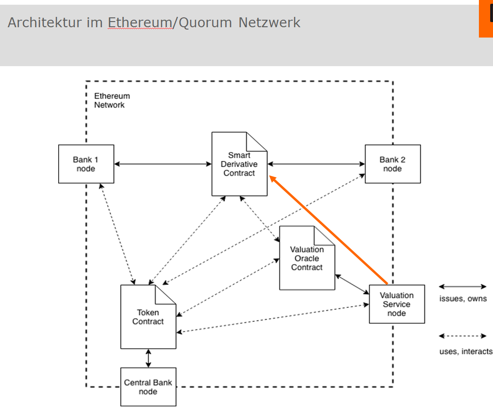
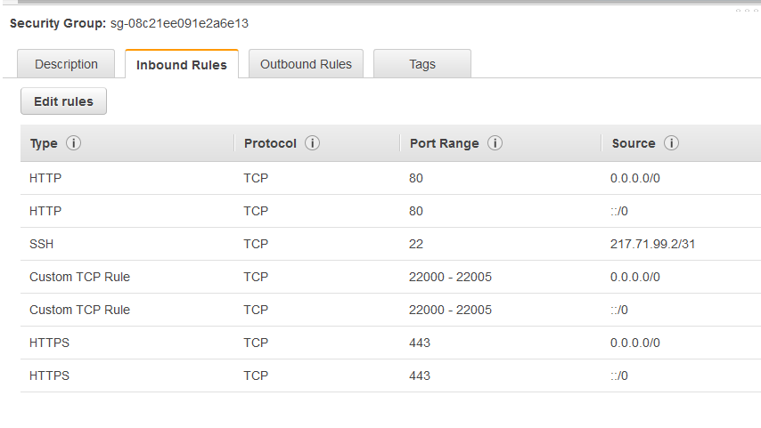
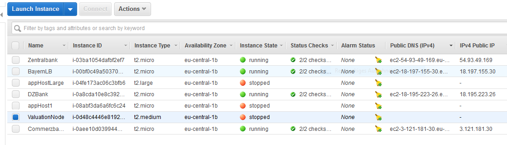

# lab-smart-derivative-contract

This README describes the setup of an example Quorum blockchain consisting of real, physically distributed nodes within an AWS virtual private cloud. 
There is another  [README] which is a predecessor of the current one and which deals with the setup of a Quorum blockchain as a development and test network.

[README]: README_QuorumSetup.md 

## Setup of Quorum by Quorum-Maker

In the first two parts the setup of AWS instances as a virtual private cloud (VPC) is sketched, the third part deals with the Quorum setup out of docker images on a cloud like that.
The tool to setup a Quorum blockchain used here is Quorum-Maker which provides for easy node administration and, in addition, for observing the nodes in a browser Web UI. 

The example Quorum blockchain to be constructed here adheres to this pcture: .

## Getting Started

### First part: Build the AWS virtual private cloud for the example blockchain

This guide does not intend to be a tutorial on the creation and management of AWS computer instances. This can be studied in the AWS documentation itself.
It is a matter of course that an AWS account must be available and it is recommended to use instances of the type _Ubuntu Server 18.04 LTS (HVM), SSD Volume Type - ami-0bdf93799014acdc4_
which can be selected in course of the __Launch Instances__ wizard.
As instance type choose _t2.medium_ which is __NOT__ free, the free version _t2.micro_ has turned out to be too restrictive in terms of RAM. On the wizard page _Step 3: Configure Instance Details_ choose 5 as the number of instances.

(__HOWEVER__: The chain of procedures described in this document could be abbreviated if you only generate one first instance, carry out all installation steps described
in the second part and then generate an image of your instance which in turn can be launched to the effect that all required packages are available automatically).

Oherwise you can choose defaults. Particular attention has to be paid to the configuration of the security group. This cannot be described in detail here, the reader must address this
topic by himself. However, a screenshot is shown here which shows the configuration of the lab AWS prototype:  
  
Of course, you must take care that the SSH port is not open to the world. The Ports withe 22000 number range are important for Quorum-Maker, the source addresses shown in the picture
require improvement.

Finally, we show a picture of the AWS view of the configured instances: 

   
 The instance names may be attached to the instances from within this view.
 
 A subpanel of this view displays the public and private IP addresses and DNS names. All of them are important. 
 
 After having launched a new instance, you can login to it by issuing a command like
 
 		ssh -i "SDC_Key.pem" ubuntu@ec2-3-121-163-14.eu-central-1.compute.amazonaws.com
 		
provided the SSH port is open on the instance and you have available your certificate (SDC_Key.pem in this case) which was generated when creating your account. 		

### Second part: Prepare for Quorum blockchain setup

There are several premises to be met:

- The instance must have git installed (usually is the case) and configured.

Issue these commands:

- curl -fsSL https://download.docker.com/linux/ubuntu/gpg | sudo apt-key add -
- sudo add-apt-repository "deb [arch=amd64] https://download.docker.com/linux/ubuntu $(lsb_release -cs) stable"
- sudo apt-get update
- apt-cache policy docker-ce
- sudo apt-get install -y docker-ce
- sudo systemctl status docker (Test/Check)

(Docker-compose):
- sudo curl -L "https://github.com/docker/compose/releases/download/1.23.1/docker-compose-$(uname -s)-$(uname -m)" -o /usr/local/bin/docker-compose
- sudo chmod +x /usr/local/bin/docker-compose
- docker-compose --version  (Test/Check)

It is very helpful if you gain access to docker without sudo:

- sudo usermod -aG docker ${USER}. Then logout and back in. 

- git clone https://github.com/synechron-finlabs/quorum-maker

All this has to be carried out on every instance. A possible alternative was described above.

### Third part: Quorum blockchain setup

Login to each of the 5 instances and follow these steps:

- Recall that the ports 22000 -22005 must be open for your incoming address (security group!).

- cd quorum-maker

- Select on of your nodes as the primary one (e.g. node _DZBank_).

- On this one and only on this one run:  

   -- (sudo) ./setup.sh create -n DZBank --ip 172.31.2.63 -r 22000 -w 22001 -c 22002 --raft 22003 --nm 80 --ws 22005  
   	  Remark: The sudo command prefix is unnecessary  if you have followed the remark about the helpful command above about the Linux docker group.
   
  
   (Recall that the name provided with the _-n_ option is in no way related to the AWS instance name. It is advisable to have both of  them equal).
	Here the address argument of _--ip_ is the private ip of this node which you can infer from the AWS EC2 instance view. Morover, we assume here that finally the node should be accessible through the browser at port 80,
	otherwise choose a different port (perhaps 22004).

- On every other node run (here shown for the node  _BayernLB_)

  (sudo) ./setup.sh join -n BayernLB --oip 172.31.2.63 --onm 80 --tip 172.31.9.96 -r 22000 -w 22001 -c 22002 --raft 22003 --nm 80 --ws 22005
		
  Here _oip_ is the private IP of the master node (DZBank) and the IP in the _--tip_ option is the IP of the curren instance.

  The script will tell you that it's waiting for approval.
  
  Start the primary node in a browser window by using its DNS address (port 80!) and you will see a small icon in the upper right corner demonstrating an approval request is pending.
  Click on it and approve.
  

- After having gone through all these steps, you can now connect to the Quorum Maker UI for each node from a web browser by pointing to http://<DNS address corresponding to your node>.

		If you'd like to restart your node (e.g. after it was down or by any other reason):
		1. Login to the node
		2. cd quorum-maker/DZBank (similarly for any other node)
		3. ./start.sh  

### Interaction with the network from outside

For command interaction with the network from either the host machine or from your PC:

#### Windows:  

- Install go-ethereum (contains geth):  look at https://github.com/ethereum/go-ethereum and follow the installation instructions there to install a stable windows binary.

#### Linux/Ubuntu:  

First check if a c-compiler is installed.

Next install the go language package:

- sudo apt-get update
- sudo apt-get -y upgrade
- wget https://dl.google.com/go/go1.11.2.linux-amd64.tar.gz
- cd /usr/local
- sudo tar xvzf ~/go1.11.2.linux-amd64.tar.gz

Next install go-ethereum:

- git clone https://github.com/ethereum/go-ethereum

- cd go-ethereum

- make geth 

- sudo cp build/bin/geth /usr/local

- sudo chmod +x /usr/local/geth

#### Command execution from within geth console

From outside (e.g. Windows):

- Attach to DZBank:  geth attach http://<DNS address of DZBank node)

From within the an instance:

- Attach to BayernLB: geth attach http://<intreal IP of the target node)

### Documentation about Quorum-Maker

See https://github.com/synechron-finlabs/quorum-maker